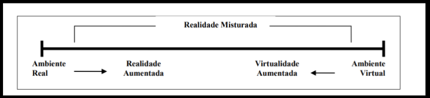

# Atividades 1

[Assunto](Assunto.pdf)  
[Slides.pdf](Slides.pdf) ou https://www.canva.com/design/DAGg5eOvwPA/04rQZ2JRQOxu9Y7uFqpZjA/edit?utm_content=DAGg5eOvwPA&utm_campaign=designshare&utm_medium=link2&utm_source=sharebutton 

Ivan -> pai da RV  

- Realidade Virtual  
  - Imersiva  
  - Diminuída  
  - Aumentada  
  - Misturada  
  - Alternativa  

Dalton usando o Google Glass  
Pokemon Go: RAl
Medidor iOS: RA
Live View: RA
  TCC Vasselai  

profa. Dentista (Márcia) pediu se não tinha como fazer algo parecido para a dentista  
TCCs orientados  

<https://github.com/dalton-reis/disciplina_RV_2025_1/tree/main/Unidade1>  

Google CardBoard

Diferenças do HMDs

  

- Óculos Estereoscópico (Head Mounted Display)  

Primeiro HMD  (1967)  

Anaglifo  

Porque os celulares tem duas câmeras  
  Equipe 2: - Digitalizador 3D (scanner)  

- Luva de Dados (Data Glove)  

Tipos diferentes  
Dalton UFRGS ,, preço  
Nitendo 5F  
